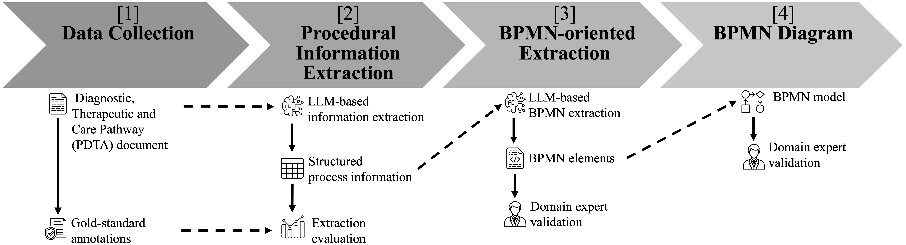

# PDTA LLM Extractor

Python 3.12 project for extracting structured knowledge from PDTA tables, extracting clinical guideline references, and generating BPMN-oriented knowledge using different LLM providers while keeping prompts and model configurations in separate JSON files.

## Pipeline



The pipeline comprises four stages: PDTA document collection, LLM-based procedural information extraction, clinical guideline extraction and evaluation, BPMN-oriented element extraction, and expert-validated BPMN modelling.

## Project structure

The project is organised into the following main components:

- `main.py` is the main entry point of the application and should be executed to run the extraction, evaluation, clinical guideline extraction, and BPMN-oriented processing workflows described below.
- `config/` contains the JSON configuration files for the supported LLM providers and models.
- `prompts/` contains the prompt templates used for procedural information extraction, clinical guideline extraction, and BPMN-oriented extraction.
- `input/` contains the source PDTA documents together with the gold-standard annotations used for evaluation.
- `output/` stores the generated JSON files, evaluation CSV files, metadata, prompts, and raw model responses.
- `src/` contains the core application modules for configuration loading, PDF processing, extraction, evaluation, clinical guideline extraction, JSON validation, and BPMN-oriented processing.
- `src/providers/` contains the provider-specific implementations for OpenAI, Anthropic, and Ollama.
- `.env.example` provides the template for defining the required environment variables and API keys.
- `pyproject.toml` defines the Python project configuration and dependencies.
- `pipeline.png` contains the graphical overview of the proposed pipeline.

## Setup

Create a Python 3.12 virtual environment:

```bash
python3.12 -m venv .venv
source .venv/bin/activate
pip install --upgrade pip
pip install -r requirements.txt
```

On Windows Command Prompt:

```cmd
py -3.12 -m venv .venv
.venv\Scripts\activate.bat
python -m pip install --upgrade pip
pip install -e .
```

Copy `.env.example` to `.env` and add the required API keys.

## Run

Both `--source-page-start` and `--source-page-end` are inclusive. For example, the values `11` and `14` select PDF pages 11, 12, 13 and 14. PDF page numbering starts at 1.

### OpenAI

```bash
python main.py \
  --pdf input/pdta_nov2025_rev1.pdf \
  --prompt prompts/extraction_prompt_v1.json \
  --config config/openai.json \
  --source-page-start 11 \
  --source-page-end 14
```

### Anthropic

```bash
python main.py \
  --pdf input/pdta_nov2025_rev1.pdf \
  --prompt prompts/extraction_prompt_v1.json \
  --config config/anthropic.json \
  --source-page-start 11 \
  --source-page-end 14
```

### Ollama

```bash
python main.py \
  --pdf input/pdta_nov2025_rev1.pdf \
  --prompt prompts/extraction_prompt_v1.json \
  --config config/ollama.json \
  --source-page-start 11 \
  --source-page-end 14
```

Two output files are generated automatically from the source file, provider, model and execution timestamp:

- `*_data.json` contains the source PDF reference and the extracted data.
- `*_metadata.json` contains the prompt name, data filename, LLM execution details and source document metadata.

Use `--output` to set the common base path for both filenames.

### Clinical guideline extraction

The project also supports extracting clinical guideline references from the entire PDTA document.

```bash
python main.py \
  --guideline-pdf input/pdta_nov2025_rev1.pdf \
  --guideline-prompt prompts/guideline_extraction_prompt_v1.json \
  --config config/openai.json
```

The generated JSON can be evaluated against a gold standard of clinical guideline names using the evaluation workflow described below.

## Evaluation

The extracted JSON can be compared against a gold-standard annotation to compute evaluation metrics for each extraction category and overall.

By default, the evaluation is performed on the `evidence` field. A different field can be selected using the optional `--field` parameter (e.g., `interpreted_values` or `interpreted_value`).

Example:

```bash
python main.py \
  --gold input/gold_standard_evidence_*.json \
  --prediction output/results.json \
  --model llama3.2
```

The evaluation generates two CSV files in the `output/` directory:

- `evaluation_details_<model>.csv` contains Accuracy, Precision, Recall, F1-score, TP, TN, FP and FN for each extraction category.
- `evaluation_summary.csv` contains one aggregated row per evaluated model. The file is updated in append mode, making it suitable for comparing multiple LLMs.

To evaluate a different field:

```bash
python main.py \
  --gold input/gold_standard_evidence_v2.json \
  --prediction output/results.json \
  --model llama3.2 \
  --field interpreted_values
```

### Clinical guideline extraction and evaluation

The complete PDF is processed by default. Clinical guideline extraction and

evaluation can be executed in a single command:

```bash
python main.py \
  --guideline-pdf input/pdta_nov2025_rev1.pdf \
  --guideline-prompt prompts/guideline_extraction_prompt_v1.json \
  --guideline-config config/openai.json \
  --guideline-gold input/gold_clinical_guideline.json

The detailed results are exported as CSV, while the summary CSV (guideline_evaluation_summary.csv) is automatically updated to facilitate comparisons across different models.

## BPMN-oriented knowledge extraction

The project also supports a second processing stage that converts the extracted PDTA knowledge into an intermediate BPMN-oriented representation. This stage does **not** generate a BPMN diagram. Instead, it identifies the candidate lanes, activities, resources and their assignments required for manual BPMN modelling.

If the extraction stage has already been completed, the BPMN-oriented knowledge can be generated from the extracted JSON:

```bash
python main.py \
  --bpmn-source output/pdta_extraction_data.json \
  --bpmn-prompt prompts/bpmn_prompt_v4.json
```

By default, the same model configuration used during extraction is reused. A different model configuration can be specified with:

```bash
python main.py \
  --bpmn-source output/pdta_extraction_data.json \
  --bpmn-prompt prompts/bpmn_prompt_v4.json \
  --bpmn-config config/openai.json
```

The BPMN-oriented stage can also be executed immediately after the extraction stage by specifying both prompts in a single command:

```bash
python main.py \
  --pdf input/pdta_nov2025_rev1.pdf \
  --prompt prompts/extraction_prompt_v1.json \
  --config config/openai.json \
  --source-page-start 11 \
  --source-page-end 14 \
  --bpmn-prompt prompts/bpmn_prompt_v4.json
```

The BPMN-oriented stage automatically generates the following output files:

- `bpmn_knowledge_detailed_*.json` contains the complete BPMN-oriented knowledge, including traceability to the extracted data.
- `bpmn_knowledge_summary_*.json` contains only the candidate BPMN lanes, activities and resources required for manual modelling.
- `bpmn_metadata_*.json` contains execution metadata.
- `bpmn_prompt_*.txt` stores the prompt sent to the LLM.
- `bpmn_raw_*.txt` stores the raw model response.

## Important design choices

- The PDF is converted locally into page-labelled text.
- The LLM receives the source filename, page numbers, table context and output schema.
- Prompt text and provider/model parameters are stored in independent JSON files.
- The LLM output is parsed and validated before it is saved.
- Execution metadata are added by Python and are not trusted to the model.
- An error JSON containing the raw provider response is saved when parsing fails.
- The extracted JSON can be evaluated against a gold standard using the built-in evaluation module.
- Clinical guideline extraction uses an independent prompt and evaluation workflow while reusing the same provider configuration and execution infrastructure.
- The BPMN-oriented stage operates on the structured extraction output rather than directly on the PDF.
- The BPMN-oriented output contains candidate lanes, activities, resources and resource-to-activity assignments, but does not generate a BPMN diagram or infer control flow.
- Both detailed and summary BPMN-oriented outputs are generated to support traceability and manual process modelling.

## Contacts

Roberto Nai (roberto.nai@unito.it)